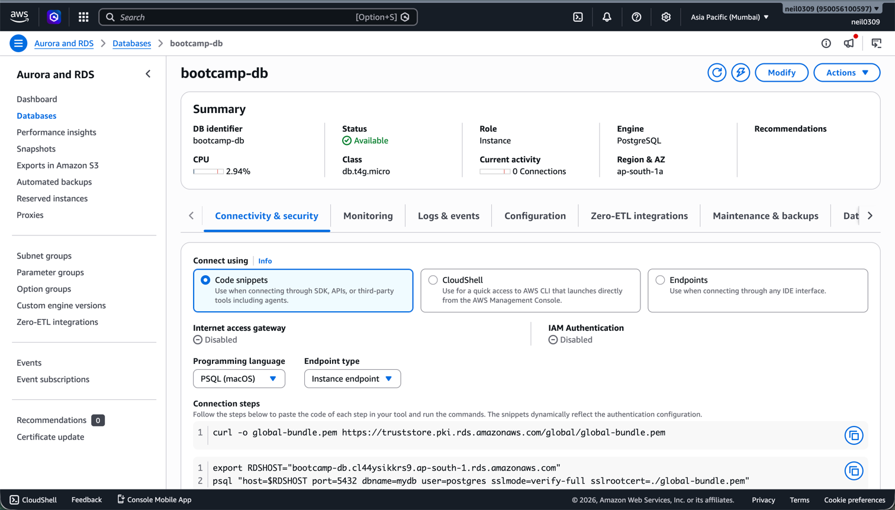
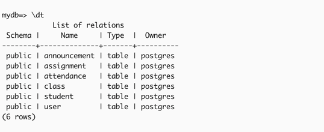
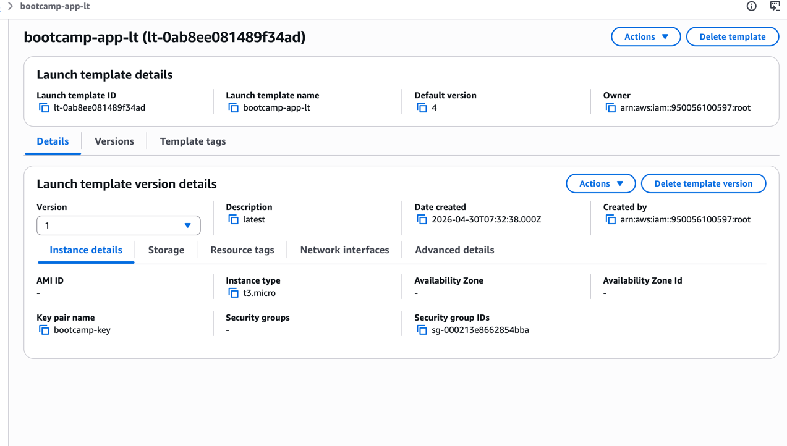
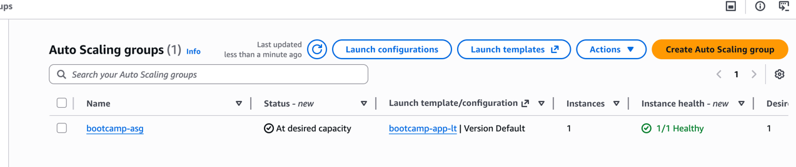
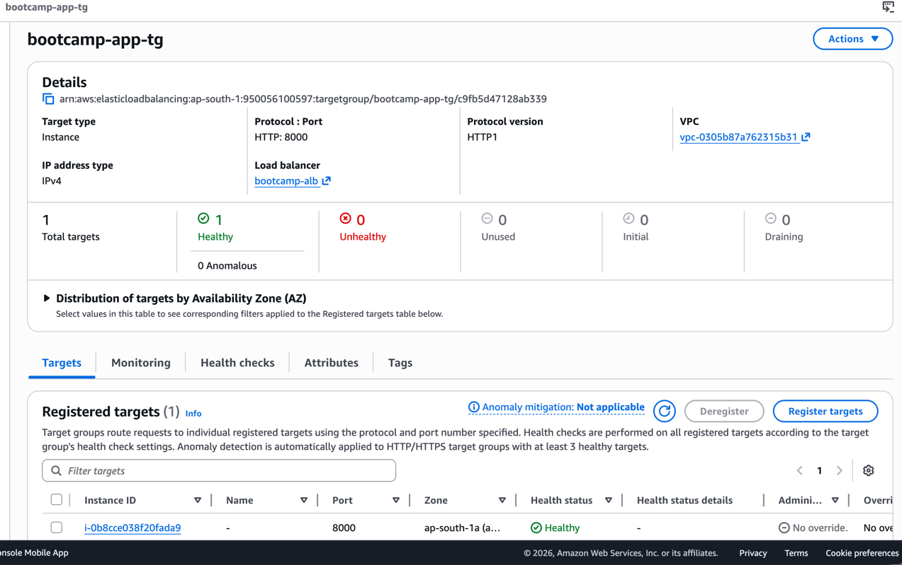
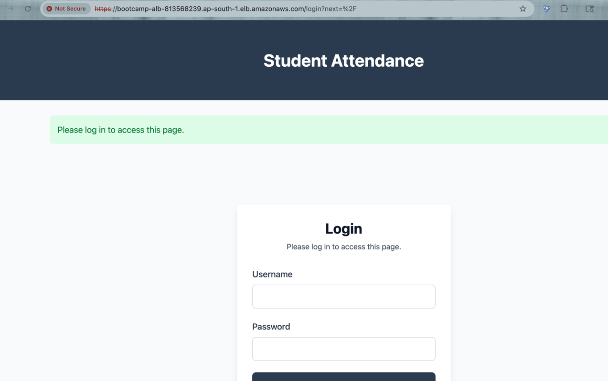
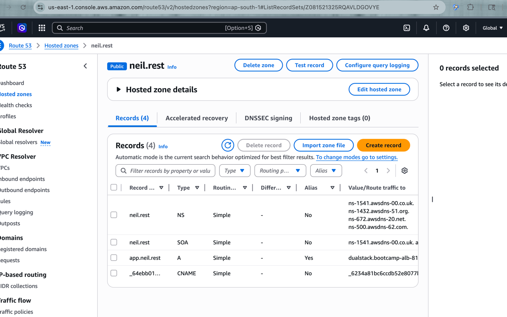
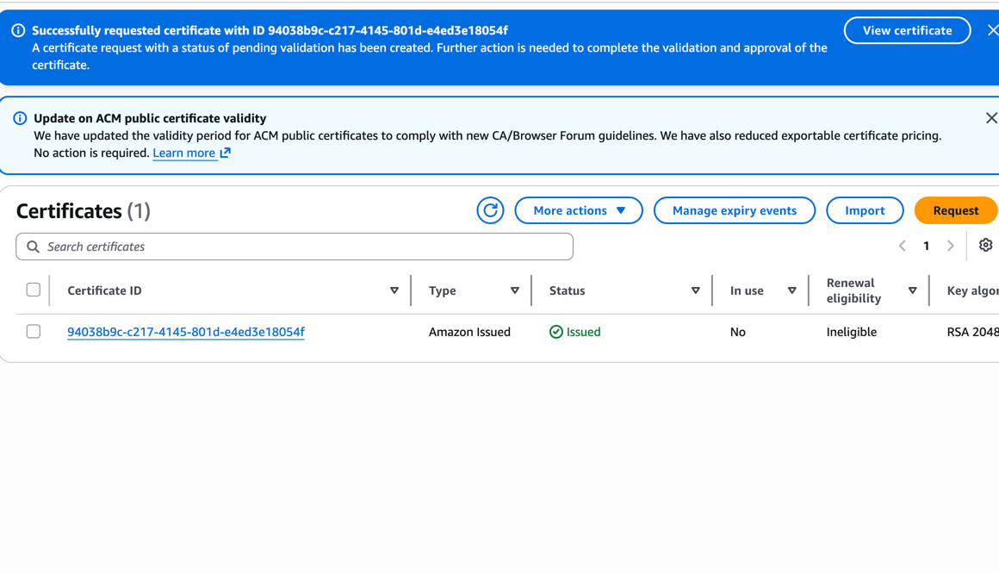
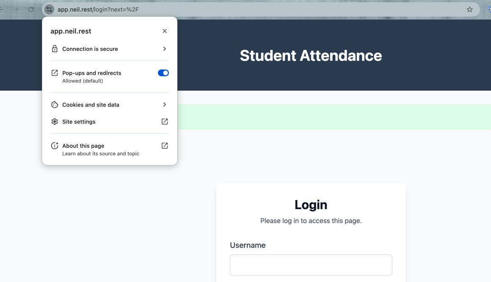

# RDS instance details page showing Single-AZ, gp3, port 5432, private

# \dt output and a SELECT from the restored DB

# Launch template version 1 details

# ASG with one healthy instance in private-1

# Target group showing healthy targets after ALB attach

# ALB DNS name returning the login page in a browser

# Route 53 record pointing to the ALB

# ACM certificate in Issued state

# Browser address bar showing https://app.<yourdomain>.com with padlock

# ASG Activity tab showing scale-out and scale-in during load test

