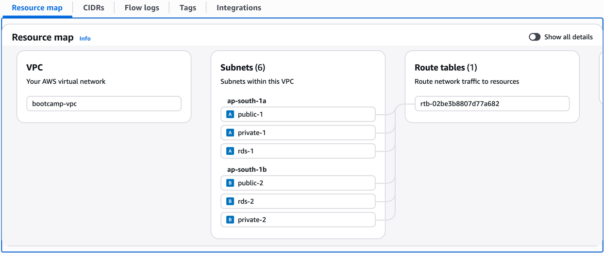
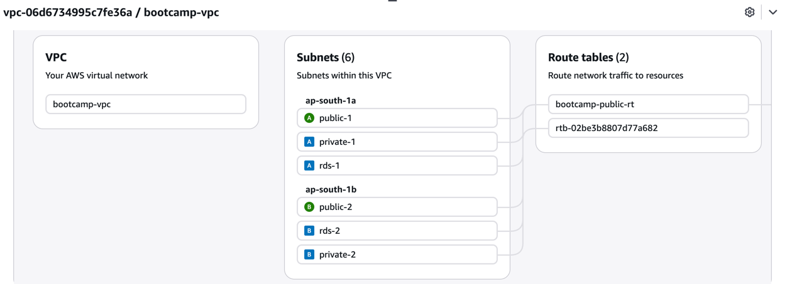
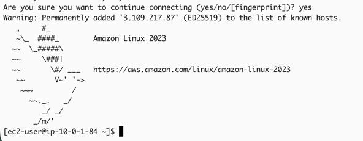
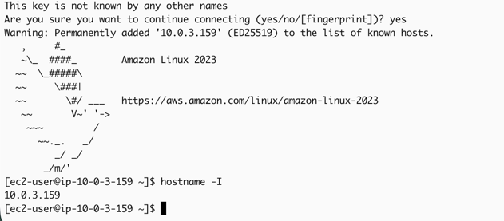
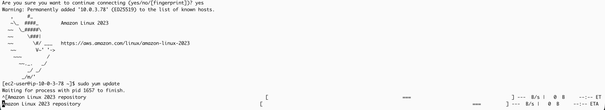
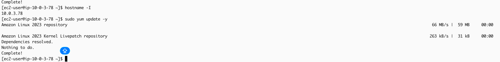
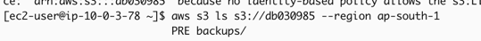

# VPC resource map showing all 6 subnets

# Both route tables with their routes and subnet associations

# Bastion successfully SSHed from your laptop

# Private EC2 successfully SSHed from the bastion

# `sudo yum update` failing on private EC2 *before* NAT Gateway

# `sudo yum update` working *after* NAT Gateway

# `aws s3 ls` working through the Gateway Endpoint *after* NAT was deleted

